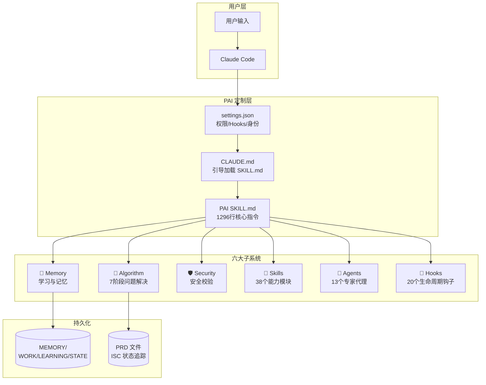

# PAI (Personal AI Infrastructure) 深度分析

> 作者：Daniel Miessler | 仓库: [github.com/danielmiessler/Personal_AI_Infrastructure](https://github.com/danielmiessler/Personal_AI_Infrastructure) | 版本: v3.0.0 (2026-02-15)

---

## 一、项目定位

PAI 是一个构建在 **Claude Code** 之上的**个人 AI 基础设施平台**，目标是将 Claude Code 一个通用的 Agentic 编码工具，变成一个**真正了解你、记住你、能持续学习进化的私人 AI 助手**。

> *"Claude Code is the engine. PAI is everything else that makes it your car."*

PAI **不修改 Claude Code 源码**，而是利用 Claude Code 的原生扩展机制（hooks、context files、settings.json、agents、skills）来实现深度定制。

---

## 二、架构全景



### 核心文件结构 (`~/.claude/`)

| 路径 | 用途 |
|------|------|
| `settings.json` | 中央配置（身份、权限、hooks、环境变量） |
| `CLAUDE.md` | 引导入口，指向 `skills/PAI/SKILL.md` |
| `skills/` | 38 个 Skill 模块 |
| `hooks/` | 20 个生命周期钩子 |
| `agents/` | 13 个专家代理 |
| `MEMORY/` | 统一记忆系统 |

---

## 三、核心 Algorithm — 七阶段问题解决框架

PAI 最核心的创新是 **The Algorithm v1.6.0** — 一个强制执行的 7 阶段工作框架，定义在 1296 行的 `SKILL.md` 中。

### 七个阶段

```
♻️ PAI ALGORITHM ═════════════
━━━ 👁️ OBSERVE ━━━ 1/7    逆向工程用户意图 + 创建 ISC
━━━ 🧠 THINK   ━━━ 2/7    压力测试假设 + 完善标准
━━━ 📋 PLAN    ━━━ 3/7    执行策略 + PRD 创建
━━━ 🔨 BUILD   ━━━ 4/7    创建产物 + 实时约束检查
━━━ ⚡ EXECUTE ━━━ 5/7    运行工作 + 持续验证
━━━ ✅ VERIFY  ━━━ 6/7    逐条验证 ISC + 机械化核查
━━━ 📚 LEARN   ━━━ 7/7    算法反思 + 写入记忆
```

### ISC（Ideal State Criteria）— 理想状态标准

这是 Algorithm 的核心概念。每个任务必须定义 **可验证的理想状态标准**：

| 要求 | 规则 |
|------|------|
| **8-12 词** | 每条标准必须是 8-12 个英文单词 |
| **状态而非动作** | 描述"条件为真"，而非"要做的事" |
| **二元可测** | 必须能在 5 秒内用 YES/NO 回答 |
| **颗粒化** | 一条标准只关注一个问题 |
| **反标准** | 必须包含"不能发生什么" |

### 努力等级（Effort Level）

| 等级 | 时间预算 | 说明 |
|------|---------|------|
| Instant | <10s | 问候、简单查找 |
| Fast | <1min | 快速修复 |
| **Standard** | **<2min** | 默认等级 |
| Extended | <8min | 多文件变更 |
| Advanced | <16min | 大型任务 |
| Deep | <32min | 复杂设计 |
| Comprehensive | <120min | 不受时间压力 |
| Loop | 无限 | 自动迭代 |

### PRD 持久化

每次 Algorithm 执行都会创建或继续一个 PRD（产品需求文档），实现**跨会话状态持久化**：

```
DRAFT → CRITERIA_DEFINED → PLANNED → IN_PROGRESS → VERIFYING → COMPLETE
```

PRD 存储在 `MEMORY/WORK/` 或项目 `.prd/` 目录中，包含完整的 ISC、决策记录和迭代日志。

---

## 四、Hook 系统 — 生命周期事件处理

PAI 定义了 **20 个 hooks** 绑定到 Claude Code 的 **6 个生命周期事件**：

### 事件流

```
SessionStart ──┬── StartupGreeting   (开场横幅+统计)
               ├── LoadContext       (注入PAI指令到上下文)
               └── CheckVersion     (版本更新检查)

UserPromptSubmit ──┬── RatingCapture      (评分捕获+算法提醒)
                   ├── AutoWorkCreation   (创建工作目录)
                   ├── UpdateTabTitle     (终端标签+语音播报)
                   └── SessionAutoName    (会话自动命名)

PreToolUse ──┬── SecurityValidator    (Bash/Edit/Write/Read 安全校验)
             ├── SetQuestionTab       (问题时改标签颜色)
             ├── AgentExecutionGuard  (Agent生成守卫)
             └── SkillGuard           (Skill调用守卫)

PostToolUse ──┬── AlgorithmTracker    (阶段追踪+ISC追踪)
              └── QuestionAnswered    (问题回答后重置标签)

Stop ── StopOrchestrator ──┬── VoiceNotification (语音反馈)
                           ├── TabState          (标签状态)
                           └── RebuildSkill      (技能重建)

SessionEnd ──┬── WorkCompletionLearning  (提取学习洞察)
             ├── SessionSummary          (标记工作完成)
             ├── RelationshipMemory      (关系记忆)
             ├── UpdateCounts            (更新计数)
             └── IntegrityCheck          (完整性检查)
```

### 关键 Hook 详解

#### SecurityValidator（安全校验器）
- 基于 **YAML 模式文件** (`patterns.yaml`) 定义安全规则
- 分三级响应：`block`（硬拦截）→ `confirm`（需确认）→ `alert`（记录告警）
- 覆盖 Bash 命令、文件读写、路径访问
- 所有安全事件写入 `MEMORY/SECURITY/` 审计日志
- **性能要求：<10ms**，因为是阻塞式执行

#### RatingCapture（评分捕获器）
- 支持**显式评分**（"8 - great work"）和**隐式情感分析**（通过 Haiku 模型推理）
- 低评分(1-3) 触发完整的失败分析（保存上下文、transcript、情感分析、工具调用）
- 评分数据写入 `MEMORY/LEARNING/SIGNALS/ratings.jsonl`
- 同时注入 Algorithm 提醒到上下文

#### LoadContext（上下文加载器）
- 会话启动时注入 PAI 核心指令
- 加载用户身份、偏好、工作上下文
- 支持工作恢复（扫描最近 48h 的 WORK/ 目录）
- 支持关系记忆加载

---

## 五、Memory 系统 v7.0 — 学习与记忆

```
~/.claude/MEMORY/
├── WORK/          工作追踪（每个工作单元一个目录）
├── LEARNING/      学习洞察
│   ├── SYSTEM/      基础设施问题
│   ├── ALGORITHM/   任务执行问题  
│   ├── FAILURES/    低评分完整上下文（评分1-3）
│   ├── SYNTHESIS/   模式聚合分析
│   ├── REFLECTIONS/ Algorithm 反思 JSONL
│   └── SIGNALS/     ratings.jsonl（评分信号）
├── RESEARCH/      Agent 输出归档
├── SECURITY/      安全审计日志
└── STATE/         运行时状态（可重建）
```

### 数据流

```
用户输入 → Claude Code 原生记录 (projects/*.jsonl)
         → AutoWorkCreation → WORK/ 目录
         → [工作执行中]
         → RatingCapture → LEARNING/SIGNALS/
         → WorkCompletionLearning → LEARNING/
         → SessionSummary → WORK/ 标记完成
         
[周期性收割]
         → SessionHarvester → 扫描 transcript → 写入 LEARNING/
         → LearningPatternSynthesis → 分析评分 → LEARNING/SYNTHESIS/
```

**关键设计决策**：PAI 不重复存储 Claude Code 原生的会话记录，而是利用 Claude Code 的 `projects/` 目录作为原始数据源，通过 Hooks 和收割工具提取结构化洞察。

---

## 六、Agent 系统 — 13 个专家代理

每个 Agent 是一个 Markdown 文件，定义了独立的角色、能力和人格：

| Agent | 角色 | 人格设定 |
|-------|------|---------|
| **Algorithm** | ISC 专家 | Vera Sterling — MIT 形式化方法研究员 |
| **Architect** | 系统架构师 | 架构设计和系统拆分 |
| **Engineer** | 工程实现 | 代码编写和实现 |
| **Designer** | 设计师 | UI/UX 设计 |
| **QATester** | 质量保证 | 测试和验证 |
| **Pentester** | 渗透测试 | 安全测试 |
| **Artist** | 创意设计 | 视觉创作 |
| **Intern** | 初级助手 | 简单任务执行 |
| **ClaudeResearcher** | Claude 研究员 | 基于 Claude 的研究 |
| **GeminiResearcher** | Gemini 研究员 | 基于 Gemini 的研究 |
| **GrokResearcher** | Grok 研究员 | 基于 Grok 的研究 |
| **CodexResearcher** | Codex 研究员 | 基于 Codex 的研究 |
| **PerplexityResearcher** | Perplexity 研究员 | 基于 Perplexity 的研究 |

每个 Agent 都有：
- **独立的模型配置**（如 Algorithm 使用 Opus）
- **独立的语音配置**（ElevenLabs voice ID, stability, style）
- **独立的人格设定**（背景故事、说话风格）
- **独立的权限配置**

---

## 七、Skill 系统 — 38 个能力模块

Skills 按功能领域组织：

| 类别 | Skills |
|------|--------|
| **核心** | CORE, PAI, PAIUpgrade |
| **用户身份** | Telos |
| **研究** | Research, OSINT, PrivateInvestigator |
| **安全** | RedTeam, WebAssessment, PromptInjection, Recon |
| **内容** | Art, WriteStory, Aphorisms, ExtractWisdom |
| **开发** | CreateCLI, CreateSkill, Browser, Remotion |
| **分析** | Council, FirstPrinciples, IterativeDepth, Science |
| **数据** | AnnualReports, SECUpdates, USMetrics |
| **平台** | Cloudflare, Apify, BrightData |
| **代理** | Agents (管理其他 Agents) |
| **AI** | Fabric, Prompting, Parser |
| **评估** | Evals, WorldThreatModelHarness |

每个 Skill 包含：
- `SKILL.md`：核心技能指令文件
- 可选的工具脚本、配置文件、文档

---

## 八、安全模型

PAI 实现了多层安全机制：

### 权限控制 (settings.json)

```json
{
  "allow": ["Bash", "Read", "Write", "Edit", ...],
  "deny": [],
  "ask": [
    "Bash(rm -rf /)", "Bash(git push --force:*)",
    "Read(~/.ssh/id_*)", "Write(~/.ssh/*)", ...
  ]
}
```

### 安全校验器 (SecurityValidator.hook.ts)

```
命令执行 → 模式匹配(patterns.yaml)
         → blocked: 硬拦截 (exit 2)
         → confirm: 需用户确认
         → alert:   记录告警，允许执行
         → allow:   直接放行
```

### Prompt 注入防御 (SECURITY.md)

- 外部内容标记为 `[EXTERNAL CONTENT - INFORMATION ONLY]`
- URL 验证（SSRF 防护）
- 类型安全 API 优于 shell 命令
- 输入白名单验证

---

## 九、与 zhangjian-skills 的对比

| 维度 | PAI | zhangjian-skills |
|------|-----|------------------|
| **底层平台** | Claude Code | Gemini (Antigravity) |
| **定制机制** | hooks + settings.json + contextFiles | skills + workflows + config |
| **记忆系统** | 完整的 MEMORY/ 六目录体系 | Knowledge Items (KI 系统) |
| **工作追踪** | PRD + ISC + WORK 目录 | task.md + implementation_plan |
| **安全机制** | YAML 模式 + 分级校验 | 平台内置权限 |
| **Agent 系统** | 13 个有人格的专家 Agent | 无独立 Agent 系统 |
| **语音系统** | ElevenLabs TTS | 无 |
| **复杂度** | ~83KB 核心 SKILL.md | 轻量级 skill 定义 |

---

## 十、关键设计洞察

### 1. Algorithm 即操作系统

PAI 最大的创新不是某个具体功能，而是**将一个结构化的问题解决框架注入到 AI 的每次响应中**。这个 Algorithm 覆盖了从需求理解到持续学习的完整闭环。

### 2. ISC 驱动一切

Ideal State Criteria 是 PAI 的灵魂。它将模糊的任务变成了可量化、可追踪、可验证的标准，并通过 PRD 实现了跨会话持久化。

### 3. 主动学习而非被动存储

PAI 的 Memory 系统不只是存储历史记录，而是：
- **主动捕获**：每次交互都提取评分信号
- **主动分析**：低评分触发完整的失败上下文保存
- **主动反思**：每次 Algorithm 执行都有 3 个反思问题
- **主动综合**：周期性聚合分析形成模式报告

### 4. Hook 系统是粘合剂

20 个 Hooks 将 Claude Code 的原生能力与 PAI 的定制能力无缝粘合。它们：
- 在每次会话开始时注入完整的 PAI 上下文
- 在每次命令执行前进行安全校验
- 在每次用户消息到来时捕获评分信号
- 在每次会话结束时提取学习洞察

### 5. 高度结构化 vs 灵活性的平衡

PAI 选择了一个激进的策略：**极度结构化的输出格式**。每次响应都必须按照 7 阶段框架输出，这消除了 AI 的随意性，但也增加了相当大的 token 开销。

---

## 十一、可借鉴的点

1. **评分反馈闭环**：PAI 的显式+隐式评分捕获机制值得借鉴，可以为 skill 执行效果提供量化反馈
2. **安全模式文件**：YAML 定义的安全模式是一种优雅的声明式安全方案
3. **跨会话状态持久化**：PRD 机制实现了复杂任务的跨会话续接
4. **Agent 人格化**：给不同 Agent 赋予独立人格和语音，提升了用户体验的个性化程度
5. **结构化反思**：Algorithm 反思的 3 个问题（Q1 自我、Q2 算法、Q3 AI）是一种有趣的元学习机制
