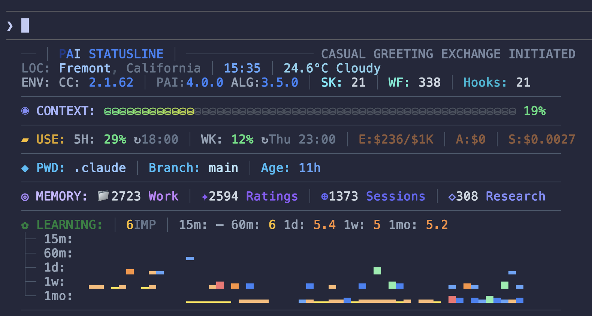

<div align="center">



# PAI v4.0.0 — Lean and Mean

**63 skills, 180 workflows, 21 hooks — and 81% of the context window is free for your actual work.**

[](../../skills/)
[](../../skills/)
[](../../hooks/)
[](../../skills/)
[](../../PAI/Algorithm/)

</div>

---

## Context is Everything

The primary point of v4.0 is becoming **lean and mean**, and that primary means **massive reduction in context usage**.

Using CC's system itself has become heavier recently, and we wanted to look at how we could really reduce PAI's default context load.

So we basically re-architected PAI to be much more of a dynamic loading system. Super lean, and then expanding as needed.

This also means using NATIVE mode a lot more, for things that don't require the algorithm. So it's a lot more intelligent about that.

Tons of other updates as well, all part of this efficiency theme.

---

## What All Changed

v3.0 made the Algorithm mechanically rigorous. But the system around it had grown unwieldy — 38 flat skill directories competing for context, dead build systems nobody used, stale version numbers scattered across dozens of files, and a Components/ directory that hadn't been functional in months.

v4.0 cuts the fat. The same capabilities, dramatically less overhead.

### The Problem v4.0 Solves

v3.0's system:
```
38 flat skill directories → each loaded its own SKILL.md description into context
Components/ directory with dead InstantiatePAI.ts → never called
DocRebuild.hook.ts → referenced dead RebuildSkill.ts handler
CLAUDE.md → static file, manually updated, easy to drift
Version refs → v3.0 hardcoded in 14+ files across the installer
```

v4.0's system:
```
12 hierarchical categories → sub-skills nested under parent SKILL.md
Dead systems removed entirely → zero orphaned hooks or handlers
CLAUDE.md generated from template → BuildCLAUDE.ts resolves variables automatically
Algorithm at PAI/Algorithm/ with LATEST pointer → single source of truth
Every version ref → 4.0.0, verified by grep
```

---

## Six Major Changes

### 1. Skill Hierarchy — 38 Directories → 12 Categories

The single biggest change. Every skill was reorganized into a hierarchical category system:

| Category | Sub-skills | What moved here |
|----------|-----------|-----------------|
| **Thinking** | FirstPrinciples, IterativeDepth, BeCreative, Council, RedTeam, WorldThreatModel, Science | 7 standalone dirs → 1 category |
| **Security** | WebAssessment, PromptInjection, SECUpdates, AnnualReports | 4 dirs → 1 category |
| **Utilities** | CreateCLI, CreateSkill, Evals, Documents, Parser, Fabric, Cloudflare, Browser, Prompting, Aphorisms | 10 dirs → 1 category |
| **Media** | Art, Remotion | 2 dirs → 1 category |
| **Investigation** | OSINT, PrivateInvestigator, Recon | 3 dirs → 1 category |
| **Scraping** | Apify, BrightData | 2 dirs → 1 category |
| **Research** | Research, ExtractWisdom | 2 dirs → 1 category |
| **Telos** | Telos | Preserved |
| **Agents** | Agents | Preserved |
| **USMetrics** | USMetrics | Preserved |
| **ContentAnalysis** | ContentAnalysis | New — extracted from Research |

**Why this matters:** Each skill category loads ONE `SKILL.md` that routes to sub-skills. Instead of 38 competing descriptions in the context window, there are 12. The routing table in `CLAUDE.md` is half the size. The model spends less context on skill discovery and more on actual work.

### 2. Dead System Removal

Three entire systems were removed because they hadn't been functional in months:

| Removed | What it was | Why it was dead |
|---------|-------------|-----------------|
| `Components/` directory | Dynamic component loading system | `InstantiatePAI.ts` was retired, nothing called it |
| `DocRebuild.hook.ts` | Stop hook that rebuilt CLAUDE.md | Called `RebuildSkill.ts` which referenced dead Components system |
| `RebuildSkill.ts` handler | Handler for DocRebuild | Imported from Components that no longer existed |

**Zero functionality lost.** These systems had been silently failing for months.

### 3. CLAUDE.md Template System

CLAUDE.md is no longer a static file. It's generated from a template:

```
CLAUDE.md.template          ← Source of truth (with variables)
    ↓
PAI/Tools/BuildCLAUDE.ts   ← Resolves variables from settings.json + LATEST
    ↓
CLAUDE.md                   ← Generated output (loaded by Claude Code)
```

**Variables resolved:**
- `{DAIDENTITY.NAME}` → Your DA's name (from `settings.json → daidentity.name`)
- `{PRINCIPAL.NAME}` → Your name (from `settings.json → principal.name`)
- `{{PAI_VERSION}}` → Current PAI version
- `{{ALGO_VERSION}}` → Algorithm version (from `PAI/Algorithm/LATEST`)
- `{{ALGO_PATH}}` → Path to algorithm file

**SessionStart hook** runs `BuildCLAUDE.ts` automatically — keeps CLAUDE.md fresh for the next session without manual intervention.

### 4. Algorithm v3.5.0

The Algorithm jumped from v1.4.0 (shipped with v3.0) to v3.5.0. Now lives at `PAI/Algorithm/v3.5.0.md` with a `LATEST` file pointing to the current version. No more digging through a Components directory to find it.

### 5. Installer Updates

Every version reference across the entire installer was audited and updated:

| File | Was | Now |
|------|-----|-----|
| `install.sh` banner | v3.0 | v4.0 |
| `cli/display.ts` | Algo v1.4.0, Installer v3.0, "Alpha" | Algo v3.5.0, Installer v4.0, "Lean and Mean" |
| `engine/state.ts` | `version: "3.0"` | `version: "4.0.0"` |
| `engine/config-gen.ts` | `version: "3.0"` | `version: "4.0.0"` |
| `engine/validate.ts` | `paiVersion: "3.0"` | `paiVersion: "4.0.0"` |
| `engine/actions.ts` | LATEST writes `v1.4.0` | LATEST writes `v3.5.0` |
| `electron/package.json` | `version: "3.0.0"` | `version: "4.0.0"` |
| `public/index.html` | v3.0 | v4.0 |
| 7 documentation files | "PAI 3.0 Alpha" | "PAI 4.0" |
| `Banner.ts` | `paiVersion = "3.0"` | `paiVersion = "4.0.0"` |
| `merger.ts` | `paiVersion = '3.0'` | `paiVersion = '4.0.0'` |

**Electron fix:** Pre-built `node_modules` removed from release. Electron installs fresh on the target machine, avoiding the macOS quarantine crash that plagued v3.0.

### 6. Security & Sanitization

Comprehensive audit with multiple agent sweeps:

- **Personal branding removed** — "Unsupervised Learning" / "UL" references cleaned from 33+ files
- **Identity templated** — Pronunciation, timezone, voice clone ID, DA personality all use template variables
- **Voice clone protected** — Personal voice clone ID replaced with `{YOUR_VOICE_CLONE_ID}` (premade voices kept as useful defaults)
- **Pronunciations cleaned** — Removed DA-revealing phonetics from VoiceServer
- **Code comments sanitized** — No personal usernames in example paths
- **Pre-commit hook updated** — New v4.0-aware bash hook replaces broken `validate-protected.ts` reference

---

## By The Numbers

| Metric | v3.0 | v4.0 | Change |
|--------|------|------|--------|
| **Context at startup** | **~38%** | **~19%** | **-50% context footprint** |
| Skill directories | 38 | 13 categories | -66% top-level dirs |
| SKILL.md files | 41 | 63 | +22 (sub-skill routing) |
| Workflows | 162 | 180 | +18 |
| Hooks | 20 | 21 | +1 |
| Agent templates | 13 | 14 | +1 |
| Total files | 1,227 | 1,151 | -76 files |
| Dead systems | 3 | 0 | Cleaned |
| Algorithm version | v1.4.0 | v3.5.0 | +21 minor versions |
| Stale version refs | 14+ | 0 | All updated |

---

## Installation

```bash
# Clone the repo
git clone https://github.com/danielmiessler/Personal_AI_Infrastructure.git
cd Personal_AI_Infrastructure/Releases/v4.0.0

# Copy the release and run the installer
cp -r .claude ~/ && cd ~/.claude && bash install.sh
```

The installer handles prerequisites, configuration, and setup. Run `source ~/.zshrc && pai` after installation.

---

## Upgrading from v3.0

If you're running v3.0:

1. **Back up** your `~/.claude/` directory
2. **Copy v4.0** over your existing installation: `cp -r .claude ~/`
3. **Run BuildCLAUDE** to generate your CLAUDE.md: `bun ~/.claude/PAI/Tools/BuildCLAUDE.ts`
4. **Verify** your `settings.json` merged correctly — your identity, voice, and preferences should persist

The template system will detect your existing `settings.json` values and generate CLAUDE.md accordingly.

---

## What's Next

v4.0 is the foundation for speed. With the context footprint cut and dead systems cleared, future releases can focus on:

- **Smarter routing** — Sub-skill routing with confidence scoring
- **Local model support** — Run skills with local models for privacy and cost
- **Granular model routing** — Route tasks to different models by complexity
- **Remote access** — Mobile and web interfaces to your PAI
</div>
